#  Chistes al Punto

Una aplicación web interactiva para compartir y calificar chistes, construida con ASP.NET Core MVC.


##  Video Demo Completo

[](https://youtu.be/rhyJZhfnM2U)

**👉 [Ver demo completa en YouTube (1:55 min)](https://youtu.be/rhyJZhfnM2U)**

##  Vista Rápida

### Explorar Chistes - Sistema de Votación y Búsqueda
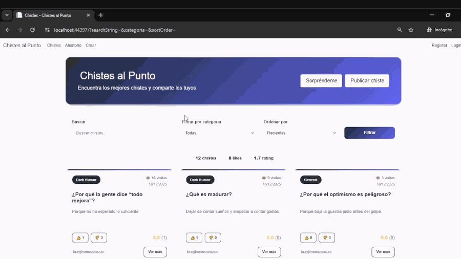

###  Autenticación y Sistema de Likes
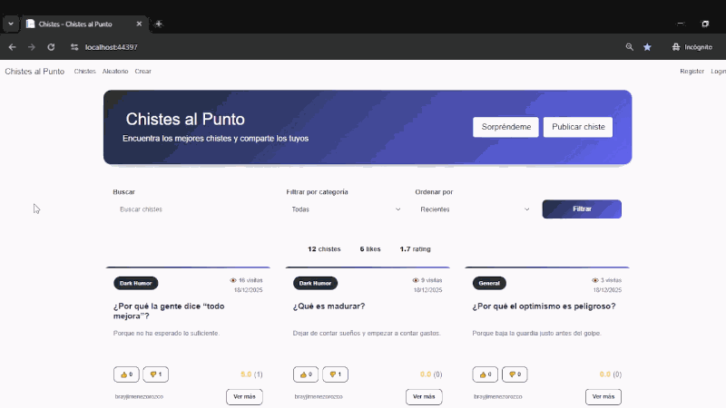

### Detalles - Likes, Dislikes y Rating por Estrellas
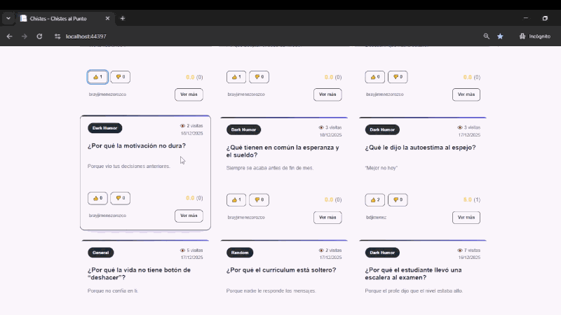

### Crear Nuevo Chiste
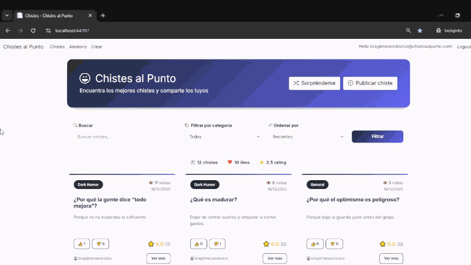

## Características

-  Sistema de autenticación con ASP.NET Identity
-  CRUD completo de chistes
-  Sistema de likes/dislikes por usuario
- ⭐ Sistema de calificación (1-5 estrellas)
-  Contador de visitas por chiste
-  Búsqueda y filtrado por categorías
-  Paginación de resultados (12 por página)
-  Función "Chiste Aleatorio"
-  Diseño responsive

## Tecnologías Utilizadas

### Backend
- ASP.NET Core 7.0 MVC
- Entity Framework Core
- SQL Server / LocalDB
- ASP.NET Identity (autenticación)

### Frontend
- HTML5 / CSS3
- JavaScript (Vanilla)
- Bootstrap 5.3
- Bootstrap Icons

##  Instalación

### Prerrequisitos
- [.NET 7.0 SDK](https://dotnet.microsoft.com/download)
- [SQL Server Express](https://www.microsoft.com/sql-server/sql-server-downloads) o SQL Server LocalDB
- [Visual Studio 2022](https://visualstudio.microsoft.com/) (recomendado)

### Pasos

1. **Clona el repositorio**
```bash
   git clone https://github.com/TU_USUARIO/chistes-al-punto.git
   cd chistes-al-punto
```

2. **Configura la base de datos**
   
   Copia `appsettings.json.example` a `appsettings.json`:
```bash
   cp appsettings.json.example appsettings.json
```
   
   Edita `appsettings.json` con tu connection string:
```json
   {
     "ConnectionStrings": {
       "DefaultConnection": "Server=(localdb)\\mssqllocaldb;Database=JokesAppDB;Trusted_Connection=true;MultipleActiveResultSets=true"
     }
   }
```

3. **Restaura paquetes NuGet**
```bash
   dotnet restore
```

4. **Aplica las migraciones**
```bash
   dotnet ef database update
```

5. **Ejecuta la aplicación**
```bash
   dotnet run
```

6. **Abre en el navegador**
```
   https://localhost:44397
```

##  Estructura del Proyecto
```
JokesAppByMe/
├── Controllers/
│   └── JokeModelsController.cs
├── Models/
│   ├── JokeModel.cs
│   ├── JokeVote.cs
│   └── JokeRating.cs
├── Views/
│   ├── JokeModels/
│   │   ├── Index.cshtml
│   │   ├── Details.cshtml
│   │   ├── Create.cshtml
│   │   ├── Edit.cshtml
│   │   └── Delete.cshtml
│   └── Shared/
│       └── _Layout.cshtml
├── wwwroot/
│   ├── css/
│   │   ├── site.css
│   │   └── jokes.css
│   └── js/
│       ├── site.js
│       ├── jokes-index.js
│       ├── jokes-details.js
│       └── jokes-create.js
├── Data/
│   └── ApplicationDbContext.cs
└── Migrations/
```

##  Modelo de Base de Datos

### JokeModel
- Id (int, PK)
- PreguntaChiste (string, 500 chars)
- RespuestaChiste (string, 1000 chars)
- Categoria (string)
- Likes (int)
- Dislikes (int)
- Vistas (int)
- RatingPromedio (double)
- TotalRatings (int)
- CreadoPor (string)
- FechaCreacion (DateTime)

### JokeVote
- Id (int, PK)
- JokeModelId (int, FK)
- UserId (string, FK)
- IsLike (bool)
- CreatedAt / UpdatedAt

### JokeRating
- Id (int, PK)
- JokeModelId (int, FK)
- UserId (string, FK)
- Value (int, 1-5)
- CreatedAt / UpdatedAt

##  Funcionalidades Principales

### Sistema de Votación
Los usuarios autenticados pueden dar like o dislike a los chistes. El sistema previene votos duplicados y permite cambiar de opinión.

### Sistema de Calificación
Cada usuario puede calificar un chiste con 1-5 estrellas. El sistema calcula el promedio automáticamente.

### Categorías
- General
- Dad Jokes
- Knock-Knock
- Dark Humor
- Tech Jokes
- Random

##  Seguridad

- Autenticación requerida para crear, editar y eliminar chistes
- Solo el creador puede editar/eliminar sus propios chistes
- Prevención de SQL Injection con Entity Framework
- Tokens CSRF en formularios
- Validación de datos en cliente y servidor

## Mejoras Futuras

- [ ] Sistema de comentarios
- [ ] Perfil de usuario con chistes creados
- [ ] Compartir en redes sociales
- [ ] API REST
- [ ] Sistema de reportes
- [ ] Chistes favoritos
- [ ] Modo oscuro
##  Capturas de Pantalla

### Página Principal

#### Vista General
Listado de chistes con sistema de votación, calificación y estadísticas en tiempo real.

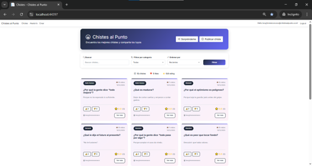

#### Más Chistes
Continuación del listado mostrando la variedad de categorías y contenido.

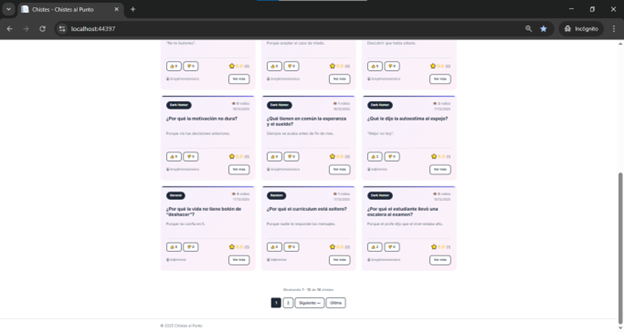

#### Sistema de Filtros
Filtrado por categorías (General, Dad Jokes, Knock-Knock, Dark Humor, Tech Jokes, Random).

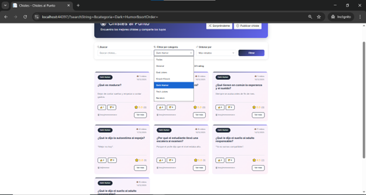

#### Paginación
Navegación entre páginas con 12 chistes por página.

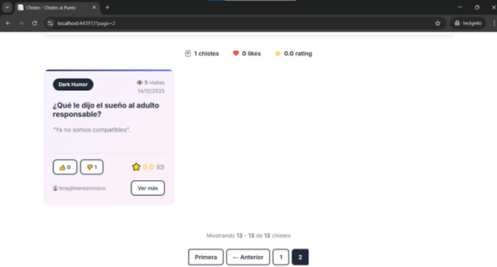

---

### Vista de Detalle

#### Información Completa
Vista detallada del chiste con botones de edición y eliminación (solo para el creador).

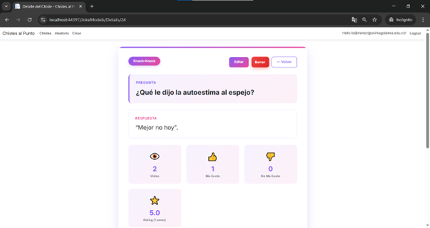

#### Estadísticas y Acciones
Estadísticas completas con sistema de likes/dislikes y calificación por estrellas.

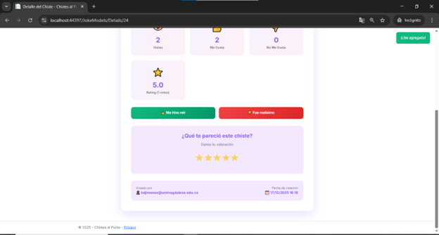

---

### Crear Nuevo Chiste

Formulario intuitivo con validación, contador de caracteres y selección de categoría.

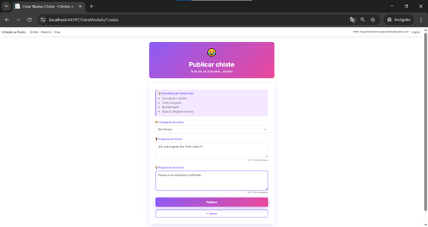

---

### Editar Chiste

Los usuarios pueden editar sus propios chistes manteniendo las estadísticas existentes.

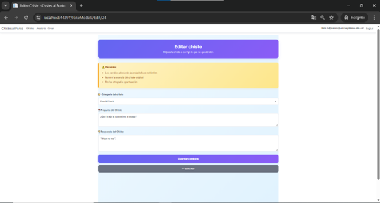

#### Selector de Categoría
Dropdown con todas las categorías disponibles.

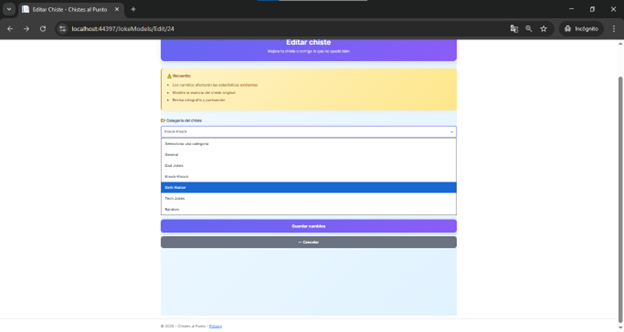

---

### Eliminar Chiste

Sistema de confirmación con advertencia clara y vista previa del chiste antes de eliminar permanentemente.

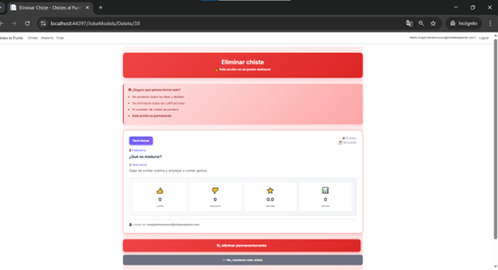

---

### Chiste Aleatorio

Funcionalidad "Sorpréndeme" para descubrir chistes al azar.

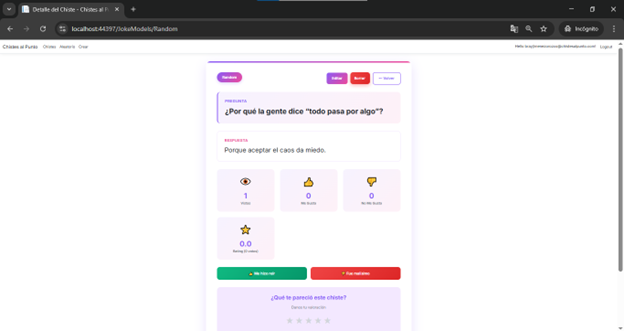

---

### Autenticación

Sistema de login y registro con ASP.NET Identity.

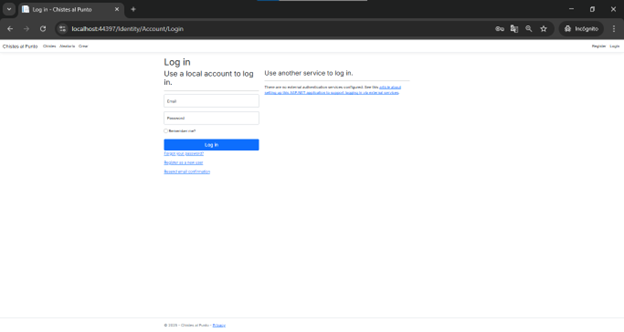

## Autor

- GitHub: [@Brayanj732](https://github.com/Brayanj732)
- LinkedIn: [Brayan Jimenez](https://www.linkedin.com/in/brayanjimenezdev)
- Email: brayanjimenezdev@outlook.com

## Licencia

Este proyecto está bajo la Licencia MIT - ver el archivo [LICENSE](LICENSE) para más detalles.

## Agradecimientos

Proyecto desarrollado como parte de mi aprendizaje en ASP.NET Core MVC.


---

⭐ Si te gustó este proyecto, no olvides darle una estrella!
```

---
